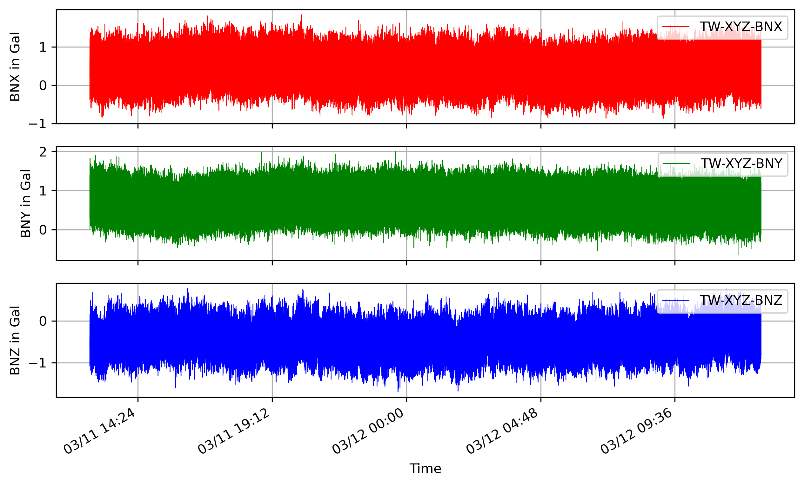

# Python utility program to write mseed file from csv
Utpal Kumar, 2021/04

## Usage
type `python csv2mseed.py -h`

```
usage: csv2mseed.py [-h] -inp INPUT [-stn STATION] [-net NETWORK] [-sr SAMPLE_RATE] [-gal GAL] [-p] [-dm]

Python utility program to write mseed file from csv based on Pandas, Numpy and Obspy (by Utpal Kumar, IESAS, 2021/04)

optional arguments:
  -h, --help            show this help message and exit
  -inp INPUT, --input INPUT
                        input CSV file to convert to mseed, e.g. network_station_data.csv
  -stn STATION, --station STATION
                        station name, e.g. XYZ
  -net NETWORK, --network NETWORK
                        network name, e.g. TW
  -sr SAMPLE_RATE, --sample_rate SAMPLE_RATE
                        sampling rate as integer
  -gal GAL, --gal GAL   1 for Gal and 0 for g
  -p, --plot_data       plot the output mseed data
  -dm, --demean         remove mean from the data

csv file format: 'Datetime', 'X', 'Y', 'Z' (2021-04-17 00:00:00.005829,0.00824,-0.01095,1.00362)
```

- Convert to mseed, remove mean and plot
```
python csv2mseed.py -inp "RCEC7B/phidgetData_0009.csv" -p -dm
```

